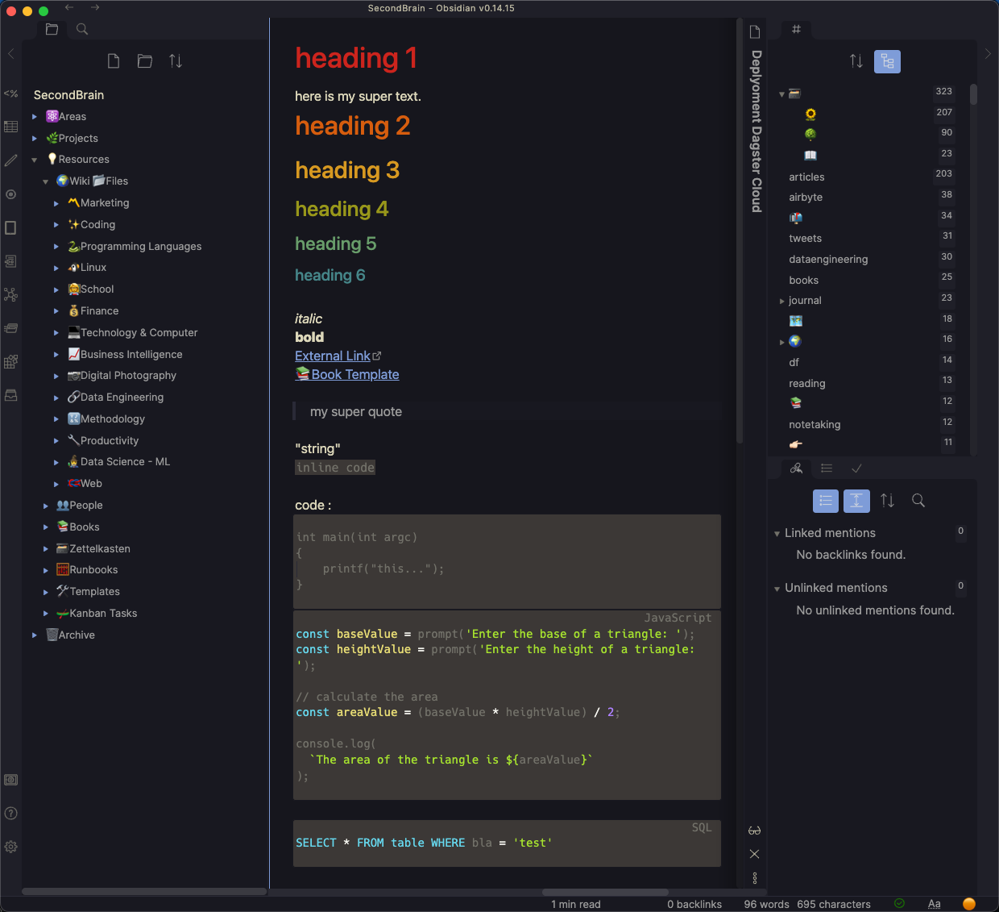
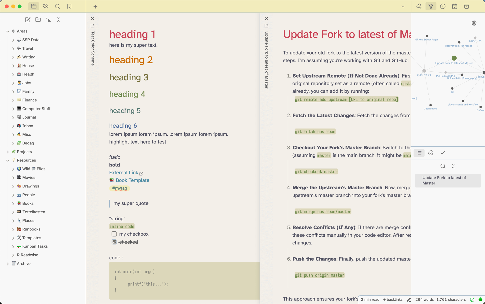

# Obsidian Kanagawa
This is a [Kanagawa](https://github.com/rebelot/kanagawa.nvim) theme for [Obsidian](https://obsidian.md/). It supports dark and light mode.

Installation: Simply search `Kanagawa` in the Obsidian Communitiy Themes and Install. Or if manually, copy the `obsidian.css` file to your vault directory and reload Obsidian for it to take effect.

## Dark Mode


## Light Mode (Lotus)



### Bump Version

```sh
npm run version
```


---

*Check also my other Theme I created, [Obsidian Rosé Pine](https://github.com/sspaeti/obsidian_rose_pine/).*
